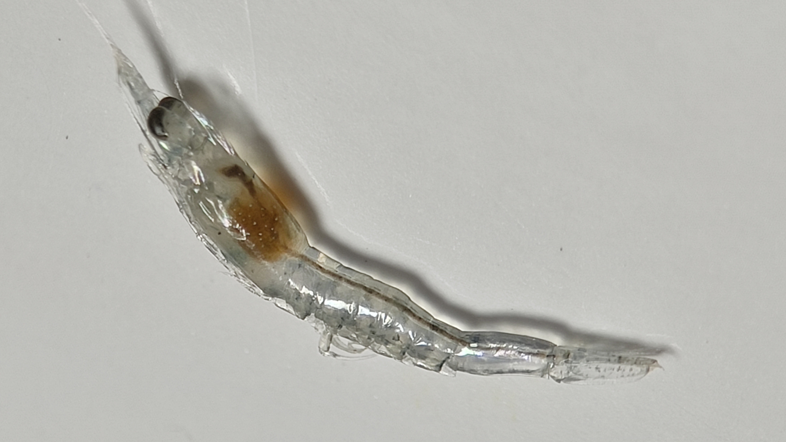

<p align="justify">
    <h1>VannameiVision</h1>
</p>

<p align="justify">
In aquaculture, early detection of susceptible shrimp larvae is of paramount importance to maintain healthy production environments. This GitHub repository introduces VannameiVision, a novel approach that combines probabilistic deep learning with transfer and deep metric learning techniques to address the challenge of accurately identifying shrimp larvae in such vulnerable conditions.
</p>


<p align="justify">
    <h2>Installation</h1>
</p>

<p align="justify">
    <h4>1. Clone the repository:</h1>
</p>

```
git clone https://github.com/kobachii-d/VannameiVision.git
cd VannameiVision
```

<p align="justify">
    <h4>2. Set up a virtual environment (optional but recommended):</h1>
</p>

```
python3 -m venv venv
source venv/bin/activate
```

<p align="justify">
    <h4>3. Install the required packages:</h1>
</p>

```
pip install -r requirements.txt
```

<p align="justify">
    <h2>Usage</h1>
</p>

<p align="justify">
To predict whether an image contains robust or susceptible shrimp larvae:
</p>

```
python main.py [path_to_image]
```

<p align="justify">
This command takes in the path to the image you wish to analyze. After processing, it will display a prediction along with a confidence percentage.
</p>

<p align="justify">
    <h2>Examples</h1>
</p>

<p align="justify">
    <h3>Robust shrimp larvae</h1>
</p>

<p align="justify">
Input:
</p>



```
python main.py images/image/robust/R1.jpg
```

<p align="justify">
Output:
</p>

```
Prediction: Robust
Confidence: 92.3%
```

<p align="justify">
    <h2>Citation</h1>
</p>

TBA

<p align="justify">
    <h2>Acknowledgements</h1>
</p>

<p align="justify">
We sincerely thank the <a href="https://www.biotec.or.th/" target="_blank">National Center for Genetic Engineering and Biotechnology (BIOTEC)</a>, <a href="https://pccp.ac.th/" target="_blank">Princess Chulabhorn Science High School Pathum Thani (PCSHS)</a>, and our families for their support and encouragement.
</p>
