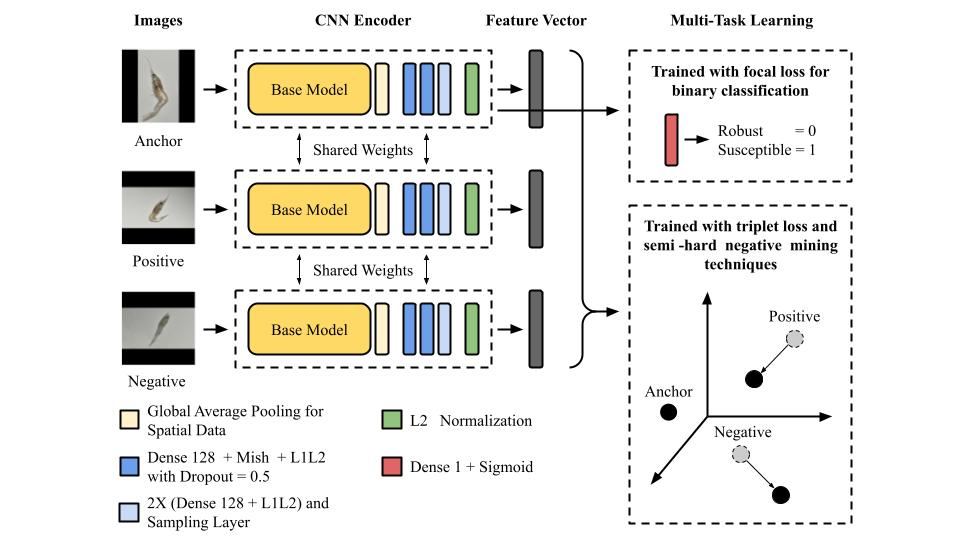

    <h1>VannameiVision: An Optimized Probabilistic Deep Learning for Susceptible Shrimp Larvae Detection</h1>

Detecting susceptible shrimp larvae is a critical challenge that requires sophisticated techniques and expertise. This project, VannameiVision, presents a novel approach to address this issue. Leveraging the combined power of probabilistic deep learning, transfer learning, and deep metric learning using a triplet loss function, we've introduced a highly optimized model for shrimp larvae detection.

Our extensive research and experiments, backed by 5-fold cross-validation, allowed us to draw some significant conclusions:

The results are a testament to our methodology's capability in accurately and robustly identifying susceptible shrimp larvae.

