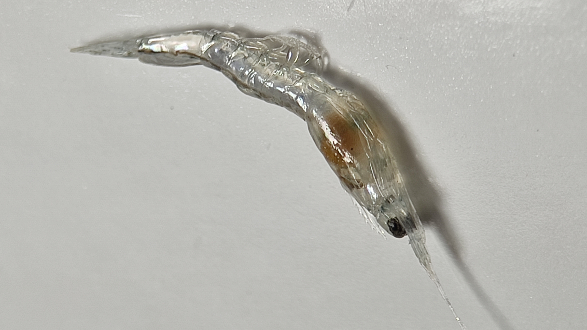
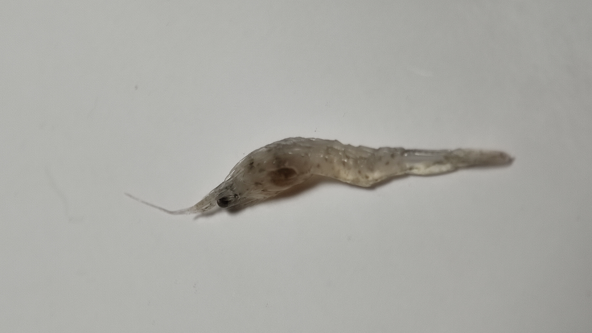

<p align="justify">
    <h1>VannameiVision</h1>
</p>

<p align="justify">
In aquaculture, early detection of susceptible shrimp larvae is of paramount importance to maintain healthy production environments. This repository introduces VannameiVision, a novel approach that combines probabilistic deep learning with transfer and deep metric learning techniques to address the challenge of accurately identifying shrimp larvae in such vulnerable conditions.
</p>


## Features

### Example data

<p align="justify">
We provide example data of robust and susceptible shrimp larvae.
</p>

```
from skimage import io
from vannameivision import *

path = sorted(get_image_paths())

fig, (ax1, ax2) = plt.subplots(1, 2)
ax1.imshow(io.imread(path[0]))
ax1.set_title(path[0].split("/")[-1])
ax1.axis("off")
ax2.imshow(io.imread(path[5]))
ax2.set_title(path[5].split("/")[-1])
ax2.axis("off")
```


<p align="justify">
Run this code to install:
</p>

```
pip install git+https://github.com/kobachii-d/VannameiVision.git
```

<p align="justify">
    <h2>Usage</h1>
</p>

<p align="justify">
To predict whether an image contains robust or susceptible shrimp larvae:
</p>

```
python main.py [path_to_image]
```

<p align="justify">
This command takes in the path to the image you wish to analyze. After processing, it will display a prediction along with a confidence percentage.
</p>

<p align="justify">
    <h2>Examples</h1>
</p>

<p align="justify">
    <h3>Robust shrimp larvae</h1>
</p>

<p align="justify">
Input:
</p>



```
python main.py images/image/robust/R1.jpg
```

<p align="justify">
Output:
</p>

```
Prediction: Robust
Confidence: 92.3%
```

<p align="justify">
    <h3>Susceptible shrimp larvae</h1>
</p>

<p align="justify">
Input:
</p>



```
python main.py images/image/susceptible/S1.jpg
```

<p align="justify">
Output:
</p>

```
Prediction: Susceptible
Confidence: 100.0%
```

<p align="justify">
    <h2>Citation</h1>
</p>

TBA

<p align="justify">
    <h2>Acknowledgements</h1>
</p>

<p align="justify">
We sincerely thank the <a href="https://www.biotec.or.th/" target="_blank">National Center for Genetic Engineering and Biotechnology (BIOTEC)</a>, <a href="https://pccp.ac.th/" target="_blank">Princess Chulabhorn Science High School Pathum Thani (PCSHS)</a>, and our families for their support and encouragement.
</p>
